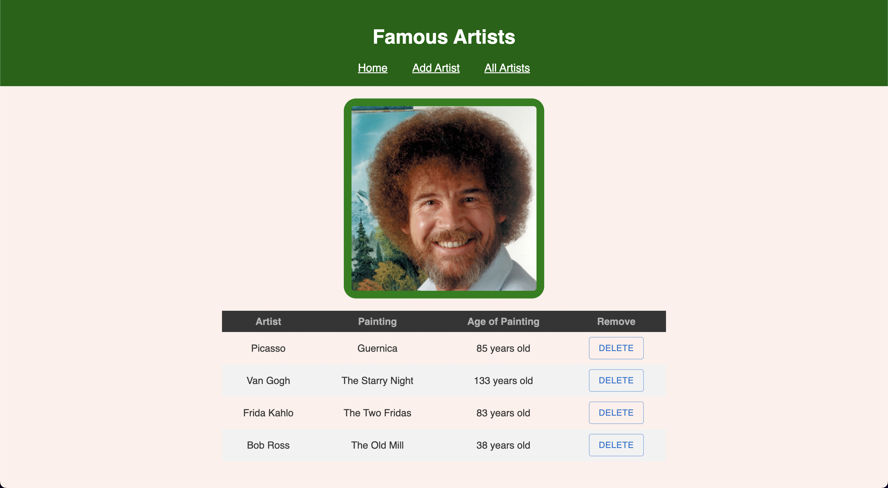

# Redux Axios Artists

## Description

A simple artists tracker with paintings in a CRUD format. A challenge to setup a database of artists that you can add to and remove.

## Interface

## Languages

JavaScript, CSS, HTML, Postgresql, and Markdown demonstrated.

## Packages

This is built using Node.js with React, Redux, Express, Pg, Nodemon, Axios, and Material UI utilized.

## Future Updates

Not likely going to be any as this was just an exercise.
